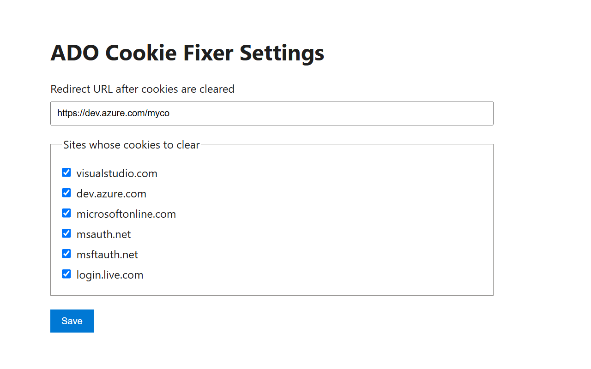
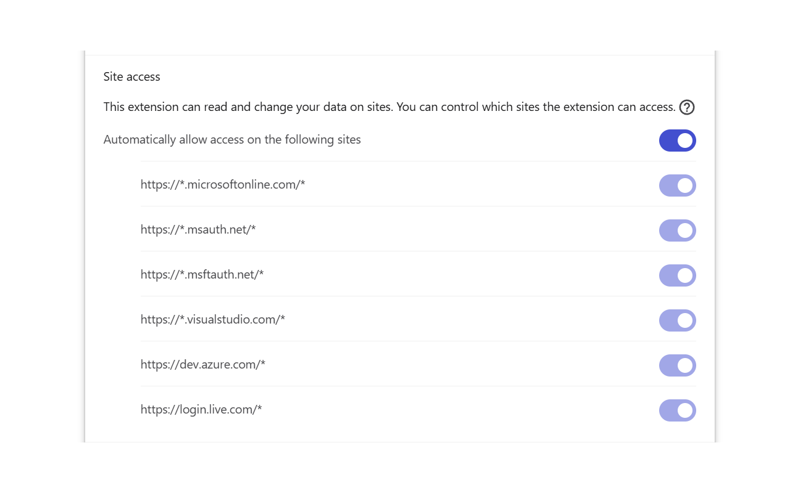

# ADO Cookie Fixer

[Install ADO Cookie Fixer from the Chrome Web Store](https://chromewebstore.google.com/detail/ado-cookie-fixer/cfohbkmhdgdonlcokhehldhnepimlpgo)

ADO Cookie Fixer is a small helper I made after running into Azure DevOps sign-in and logout loops. Clearing the related cookies was often enough to get unstuck, so this extension makes that reset quick without clearing every cookie in the browser. I hope it is useful to others dealing with the same problem.

## What it does

- Clears cookies for the Azure DevOps and Microsoft sign-in sites you select.
- Optionally redirects the active tab to your chosen login URL after clearing cookies.
- Shows a confirmation before clearing by default.
- Displays the number of cookies cleared on the extension icon.

## Install and use

1. Install [ADO Cookie Fixer from the Chrome Web Store](https://chromewebstore.google.com/detail/ado-cookie-fixer/cfohbkmhdgdonlcokhehldhnepimlpgo).
2. On first install, set the URL to open after cookies are cleared and choose the sites to include.
3. Click the extension icon when you are caught in a sign-in or logout loop.
4. Confirm clearing the selected cookies. You can turn off the confirmation or redirect in the extension settings.

## Cookie scope

By default, the extension can clear cookies for:

- `visualstudio.com`
- `dev.azure.com`
- `microsoftonline.com`
- `msauth.net`
- `msftauth.net`
- `login.live.com`

Chrome asks for access to the selected sites when you first use the extension. No other sites are included unless Chrome permissions or the extension source are changed.

## Feedback and feature requests

Feature ideas, bug reports, and contributions are welcome. Please [open an issue](https://github.com/Rowdster/ADOLogoutCookieFix/issues) and describe the sign-in flow or behavior you would like the extension to support.

## Local development

1. Clone this repository.
2. In Chrome, open `chrome://extensions` and enable **Developer mode**.
3. Select **Load unpacked** and choose this repository folder.